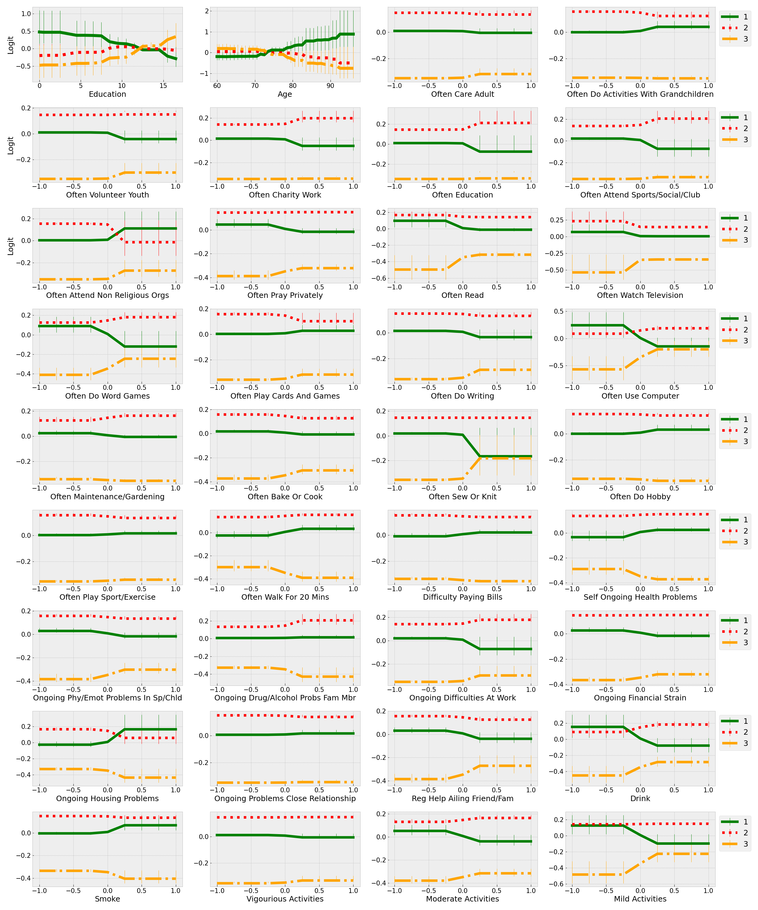
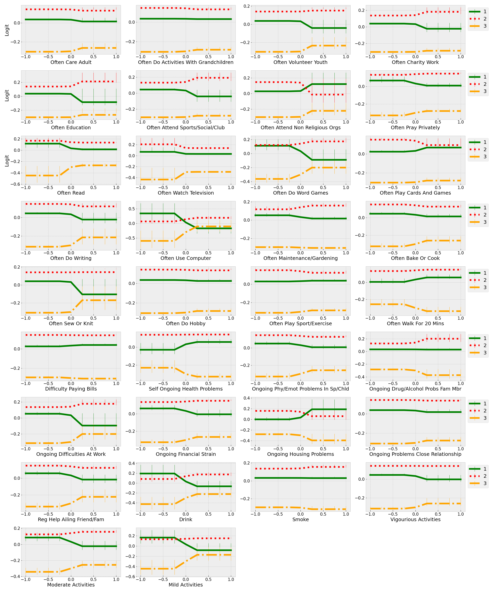
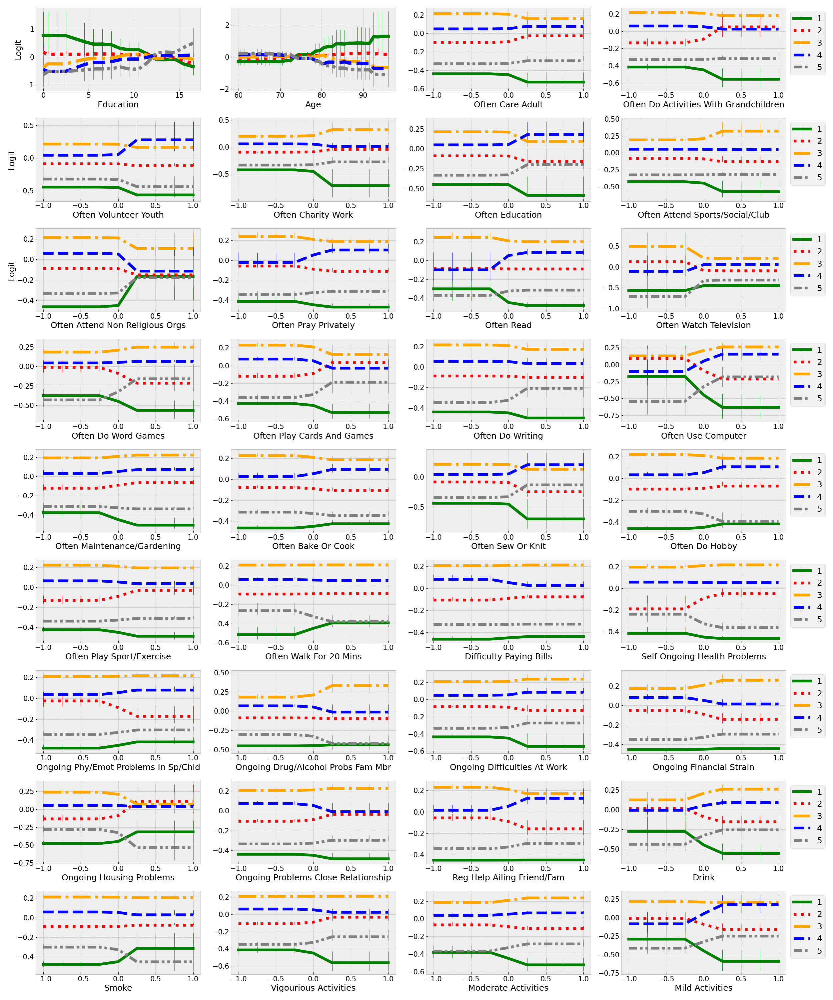
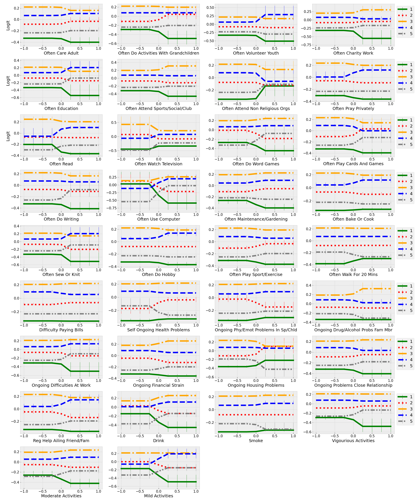
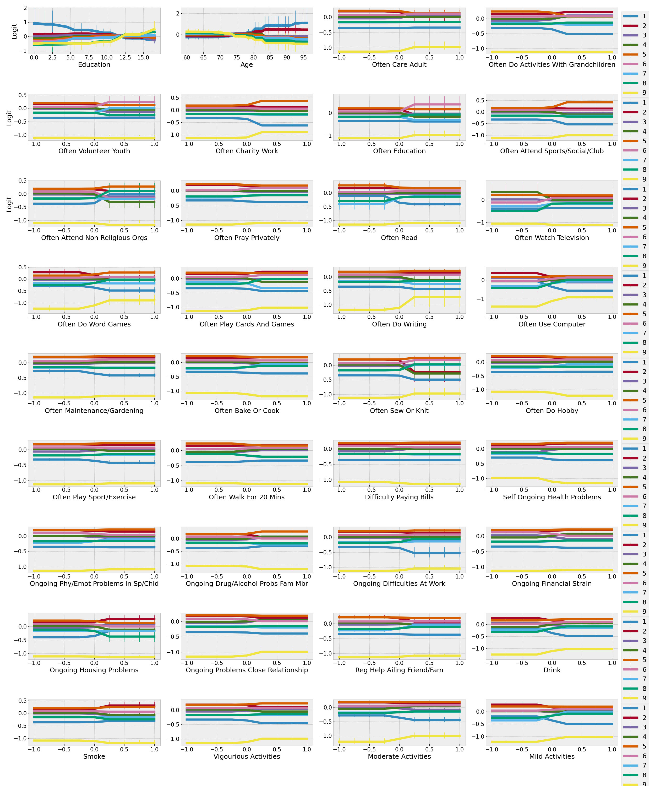
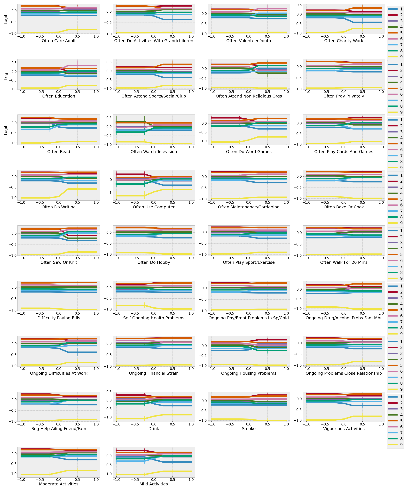

This repository contains the code source of experiments performed in the paper "Impact of daily lifestyle activities on the cognitive health of older adults: An interpretable machine learning approach" submitted at NeurIPS 2022". In this paper, we used the Explainable Boosting Machine (EBM) model to assess the relationship between background factors (Age and Education), daily lifestyle activities, and the cognitive health of older adults.

# MODULES

The modules are described as follows:

- experiments.py: contains the main code to run all experiments.
- src/explain.py: contains the Explain class used to provide the following explanations
  - Feature importance (Mean absolute logit from the EBM model).
  - Weights associated to each variable bin. These weights are used to plot a linear relationship between the dependent and independent variables.
  - Statistical significance scores: z-scores and p-values.
- src/plotting.py: contains utility functions for plotting.
- src/utils.py: contains addtional utility functions.
- src/type_experiments.py: contains a class used to specify the type of experiments to run.
- src/cross_validation.py: contains a class used to cross-validate selected machine learning models. This module is used to compare the performance of the EBM, Logistic Regression, XGBoost, and Multi-Layer Perceptrons.
- src/config.py: contains experimental settings (data set name, plotting parameters, etc...).

# EXPERIMENTS

All experiements in our paper are reproducible. To that end, please follow the instructions below.

1. Dowload the 2012 and 2016 waves of Health and Retirement Study dataset [here](https://hrs.isr.umich.edu/).
2. Concatenate the two waves so that each individual in the dataset has two observations (2012 and 2016).
3. Drop all missing values and filter the dataset by selecting only individuals with age >= 60.
4. Select the variables used in the experiments:
   - Immadiate and delayed cognitive scores used to create a composite score.
   - Continuous variables: Age and Education.
   - Binary variables: see Table A.2 in the paper.
5. Process the selected variables:
   - Cognitive scores: create a composite score (Immadite + Delayed scores) and stratify the obtain scores into 3, 5, and 9 cognitive categories.
   - Binarize the daily lifestyle activities with the process described in Section 3.1 in the paper.
6. Install package dependencies:

```sh
pip install -r requirements.txt
```

7. Set the experiment configurations (dataset name, saving paths in your computer) in the config.py file.
8. Run the experiments with the following command:

```python
python experiments.py
```

If you would like to integrate performance comparison in each experiments specify the --perf_comp flag as follows:

```python
python experiments.py --perf_comp
```

# SUPLEMENTARY RESULTS

Due to space consideration in the main paper and supplementary material, we reported results corresponding the 12 most important variables from the EBM model. We provive the following supplementary results:

- Linear equations of all independent variables.
- P-values associated to all bins for continuous variables and category 1 for all independent variables.

## Dependent variable with 3 cognitive categories ($Cogn_3$)

### Linear equations


Linear equations associated to all independent variables when age and education are considered in the experiment.


Linear equations associated to all independent variables when age and education are not considered in the experiment.

### P-values

[p-values-cogn-3-with-ae](./results/cogn_3_cats/p_values_cogn_3_cats_with_AE_all_vars.md)
P-values associated to independent variables when age and education are considered in the experiment.

[p-values-cogn-3-without-ae](./results/cogn_3_cats/p_values_cogn_3_cats_without_AE_all_vars.md)
P-values associated to independent variables when age and education are not considered in the experiment.

## Dependent variable with 5 cognitive categories ($Cogn_5$)

### Linear equations


Linear equations associated to all independent variables when age and education are considered in the experiment.


Linear equations associated to all independent variables when age and education are not considered in the experiment.

### P-values

[p-values-cogn-5-with-ae](./results/cogn_5_cats/p_values_cogn_5_cats_with_AE_all_vars.md)
P-values associated to independent variables when age and education are considered in the experiment.

[p-values-cogn-5-without-ae](./results/cogn_5_cats/p_values_cogn_5_cats_without_AE_all_vars.md)
P-values associated to independent variables when age and education are not considered in the experiment.

## Dependent variable with 9 cognitive categories ($Cogn_9$)

### Linear equations


Linear equations associated to all independent variables when age and education are considered in the experiment.


Linear equations associated to all independent variables when age and education are not considered in the experiment.

### P-values

[p-values-cogn-9-with-ae](./results/cogn_9_cats/p_values_cogn_9_cats_with_AE_all_vars.md)
P-values associated to independent variables when age and education are considered in the experiment.

[p-values-cogn-9-without-ae](./results/cogn_9_cats/p_values_cogn_9_cats_without_AE_all_vars.md)
P-values associated to independent variables when age and education are not considered in the experiment.
